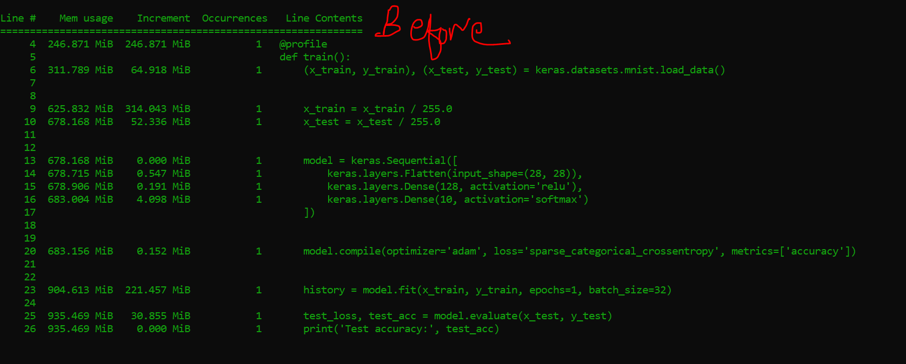
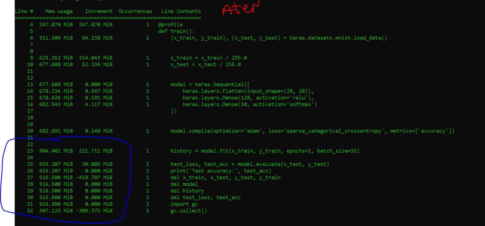

# Reduce-memory-for-machine-learning-models
This post is related to memory management when working with datasets with huge datasets, as working with a huge dataset can result in an out-of-memory error and increases the execution time of the code. 

The process of cleaning memory is different. 
1. Remove variables and functions you will not use in the code.
2. Call the garbage collector.

**Before**

**After**

